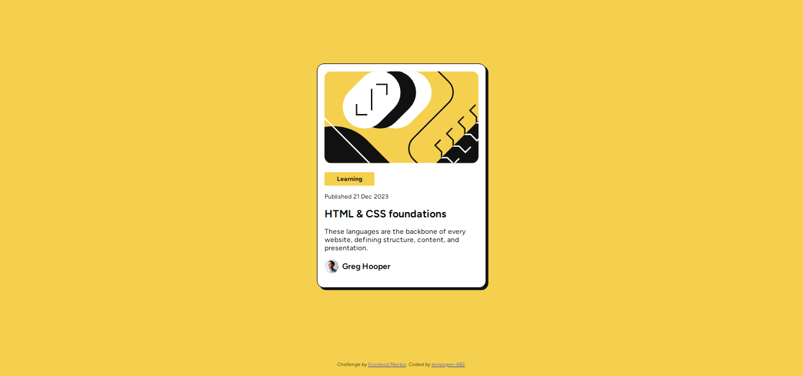

# Frontend Mentor - Blog preview card solution

  

This is a solution to the [Blog preview card challenge on Frontend Mentor](https://www.frontendmentor.io/challenges/blog-preview-card-ckPaj01IcS).

### Screenshot

  

 

### Links

  

- Solution URL: [Frontend Mentor](https://www.frontendmentor.io/solutions/blog-preview-card-YD0D_TjWXN)

- Live Site URL: [https://temesgen-982.github.io/blog-preview-card/](https://temesgen-982.github.io/blog-preview-card/)

  

### Built with

  

- HTML5

- CSS custom properties

- Flexbox

- CSS Grid
  

### Continued development

- Organizing the CSS file in a better way